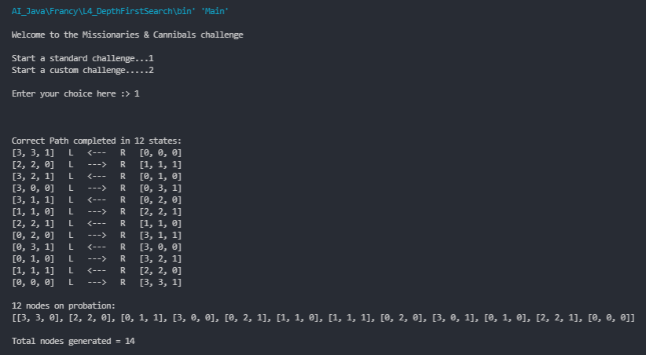

# Depth-First Search (DFS) - River-Crossing Logic Puzzle

In this project, the **Depth-First Search (DFS) algorithm** will be implemented in Java. The DFS algorithm will be used to solve two classic river-crossing logic puzzles: **The Missionaries and Cannibals Problem** and **The Jealous Husbands Problem**. The Missionaries and Cannibals Problem is a well-known toy problem in artificial intelligence and serves as an example of problem representation.

## DFS Overview

The Depth-First Search (DFS) algorithm is a graph traversal technique that explores as far as possible along each branch before backtracking. It is an essential tool in solving various problems, including pathfinding and puzzles.

### The Missionaries and Cannibals Problem

The Missionaries and Cannibals Problem is a river-crossing puzzle in which three missionaries and three cannibals must cross a river using a boat that can carry at most two people. The goal is to move all missionaries and cannibals to the opposite bank without ever having the number of cannibals exceed the number of missionaries on either side. The DFS algorithm will help us find a sequence of moves to solve this problem.

### The Jealous Husbands Problem

The Jealous Husbands Problem is another variant of the river-crossing puzzle. In this problem, three husbands and their wives want to cross a river using a boat that can carry at most two people. However, no woman should be left in the presence of another man unless her husband is also present. The objective is to find a sequence of moves that allows all individuals to reach the opposite bank safely.

## Getting Started

To solve the river-crossing logic puzzle using DFS, follow these steps:

1. Clone this repository to your local machine.
2. Open the project in your preferred Java IDE.
3. Run the `Main.java` class.
4. The program will prompt you to select one of the two challenge options: standard or customizable.
5. If you choose the customizable option, you can edit the parameters of the puzzle (e.g., number of cannibals, missionaries, boats) as instructed by the program.
6. The DFS algorithm will then solve the selected puzzle and display the sequence of moves to cross the river safely.

## Example

## Contributions

Contributions to this project are welcome. If you have any suggestions for improvements or wish to add more features or river-crossing puzzles, feel free to submit a pull request.

## License

This project is under the [MIT License](https://en.wikipedia.org/wiki/MIT_License), allowing you to use, modify, and distribute the code freely.

## Acknowledgments

Special thanks to Saul Amarel for introducing the Missionaries and Cannibals Problem and providing it as an example of problem representation in artificial intelligence.

Let's embark on a challenging journey of river-crossing logic puzzles using the Depth-First Search algorithm! Happy solving! 🚣‍♂️🚣‍♀️
