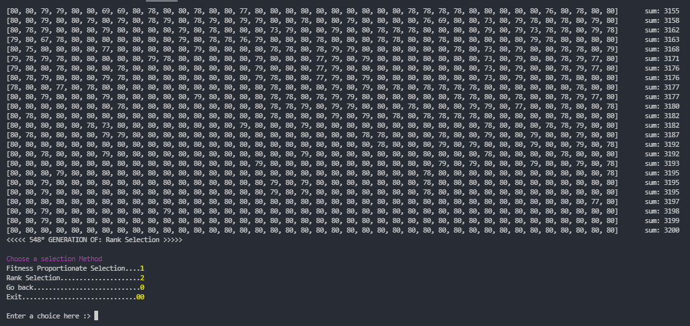

# Genetic Algorithm - Java Implementation

In this project, we focus specifically on the **Genetic Algorithm**, which is a powerful search heuristic inspired by the process of natural selection. The goal of this project is to implement the Genetic Algorithm in Java and explore two different selection methods: **Fitness Proportionate Selection** and **Rank Selection**. Both methods are used to create the next generation of solutions based on their fitness scores.

## Genetic Algorithm Overview

The Genetic Algorithm (GA) mimics the process of evolution to find optimal solutions to a problem. It starts with a population of potential solutions, which are represented as chromosomes. These chromosomes encode the problem's solutions in a way that is specific to the problem domain.

The GA proceeds through a series of generations, and in each generation, it applies three fundamental genetic operators:

1. **Selection**: This process chooses individuals from the current population to form the next generation based on their fitness scores. Individuals with higher fitness are more likely to be selected.

2. **Crossover**: Crossover is the process of combining genetic information from two parent chromosomes to create one or more offspring. It promotes exploration of the solution space.

3. **Mutation**: Mutation introduces random changes to the offspring's genetic information, encouraging further exploration and preventing premature convergence.

The process of selection, crossover, and mutation is repeated for several generations until the algorithm converges to an optimal or near-optimal solution.

## Selection Methods

In this project, we will implement and compare two selection methods: **Fitness Proportionate Selection** and **Rank Selection**.

### Fitness Proportionate Selection

Fitness Proportionate Selection, also known as Roulette Wheel Selection, is a widely used selection method in Genetic Algorithms. It selects individuals from the current population with a probability proportional to their fitness scores. Individuals with higher fitness scores have a higher chance of being selected as parents for the next generation.

### Rank Selection

Rank Selection is another selection method that assigns ranks to individuals based on their fitness scores. The fittest individual receives rank 1, the second fittest receives rank 2, and so on. The selection probability is then based on the rank rather than the raw fitness score. Rank Selection tends to provide a more uniform selection pressure, benefiting lower-ranked individuals.

## Getting Started

To run the Genetic Algorithm with both selection methods, follow these steps:

1. Clone this repository to your local machine.
2. Open the project in your preferred Java IDE.
3. Run the `Main.java` class.
4. Choose a selection method from the menu displayed in the terminal.
5. Examine the output results and compare the performance of both selection methods.

## Example

## Contributions

Contributions to this project are welcome. If you have any suggestions for improvements or wish to add more features or selection methods, feel free to submit a pull request.

## License

This project is under the [MIT License](https://en.wikipedia.org/wiki/MIT_License), allowing you to use, modify, and distribute the code freely.

## Acknowledgments

Special thanks to the community for their valuable insights and resources on Genetic Algorithms and various selection methods.

Let's explore the power of Genetic Algorithms and discover optimal solutions to complex problems! Happy coding! 🧬