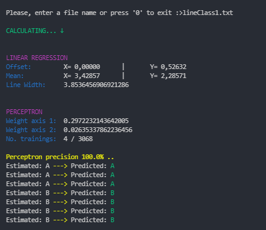

# Perceptron - Java Implementation

In this project, the **Perceptron** algorithm will be implemented in Java. The Perceptron is a fundamental building block of neural networks and is used for binary classification problems. The goal of this project is to create a perceptron model from scratch and test it on three datasets: `lineClass0.txt`, `lineClass1.txt`, and `lineClass2.txt`. These datasets contain two linearly separable clusters of points, making them suitable for testing the perceptron's binary classification capabilities.

## Perceptron Overview

The Perceptron is a supervised learning algorithm used to classify input data into one of two classes (usually labeled as 0 and 1). It takes input features, applies weights to them, and passes them through an activation function to make predictions. During the training process, the algorithm adjusts the weights based on the input data to improve the accuracy of predictions.

The learning rule used by the perceptron is simple and iterative. It updates the weights incrementally to minimize the classification error. The perceptron continues to update the weights until the training data is correctly classified or a specified number of iterations is reached.

## Getting Started

To test the Perceptron on the provided datasets, follow these steps:

1. Clone this repository to your local machine.
2. Open the project in your preferred Java IDE.
3. Run the `Main.java` class.
4. Upon execution, the program will prompt you to provide the filename of the dataset to test (e.g., `lineClass0.txt`). Enter the desired filename from the command line.
5. The Perceptron will be trained on the chosen dataset and display the classification results.

## Example

## Contributions

Contributions to this project are welcome. If you have any suggestions for improvements or wish to add more features, feel free to submit a pull request.

## License

This project is under the [MIT License](https://en.wikipedia.org/wiki/MIT_License), allowing you to use, modify, and distribute the code freely.

## Acknowledgments

Special thanks to the community for their valuable insights and resources on the Perceptron algorithm and binary classification.

Let's dive into the world of Perceptron and witness its binary classification prowess! Happy coding! 🧠
